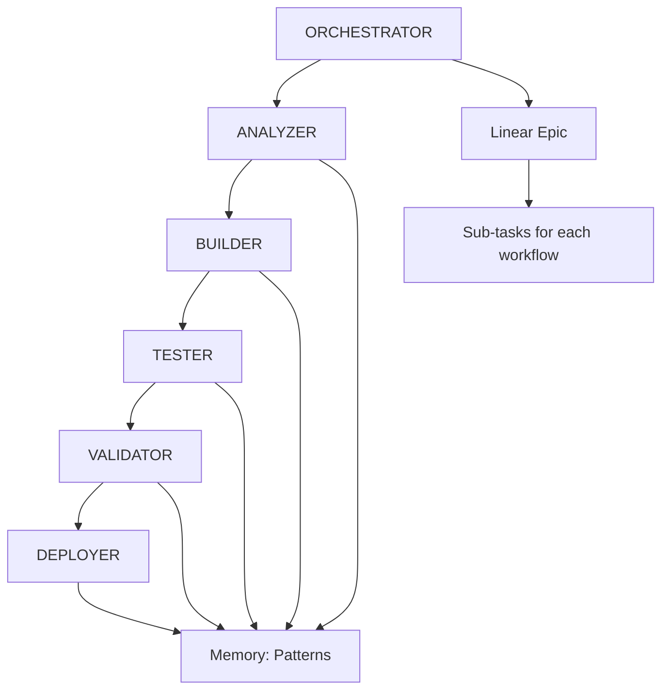

# AutoMagik Tools Automated Development Workflows

## Overview

This directory contains specialized workflows for automated MCP tool development. Each workflow focuses on a single aspect of the development lifecycle, enabling rapid creation of high-quality MCP tools with minimal human intervention.

## Workflow System Architecture

### Core Philosophy
- **Ultra-Specialization**: Each workflow does ONE thing perfectly
- **Linear Integration**: Project management through Linear issues
- **Memory-Driven**: Learn from every tool creation
- **Pattern Reuse**: >80% code reuse from existing tools
- **Quality First**: Automated testing and validation

### Available Workflows

1. **ORCHESTRATOR** - Project management and workflow coordination
2. **ANALYZER** - Requirements analysis and planning
3. **BUILDER** - Tool implementation and coding
4. **TESTER** - Comprehensive testing and coverage
5. **VALIDATOR** - Quality assurance and compliance
6. **DEPLOYER** - Package, deploy, and publish

## Quick Start

### Creating a New MCP Tool

To create a new tool, use the ORCHESTRATOR workflow:

```
Create a new MCP tool for [API/Service Name] that [description of functionality].
API documentation: [OpenAPI spec URL or documentation link]
Authentication: [auth method - API key, OAuth, etc.]
Priority: [high/medium/low]
```

Example:
```
Create a new MCP tool for Discord API that enables message management and channel operations.
API documentation: https://discord.com/developers/docs/reference
Authentication: Bot token
Priority: high
```

### Workflow Execution Flow



## Detailed Workflow Guide

### 1. ORCHESTRATOR Workflow

**Purpose**: Coordinate all workflows and manage the development epic

**Triggers**:
- New tool request
- Tool enhancement epic
- Bug fix coordination

**Key Actions**:
- Creates Linear epic with sub-tasks
- Searches memory for similar tools
- Coordinates workflow execution
- Tracks progress and metrics

**Example Input**:
```
Orchestrate development of a Slack MCP tool with message posting, channel management, and user lookup capabilities. Use OAuth2 authentication.
```

### 2. ANALYZER Workflow

**Purpose**: Analyze requirements and create implementation plan

**Inputs from ORCHESTRATOR**:
- Tool requirements
- API documentation/OpenAPI spec
- Similar tool references

**Outputs**:
- `docs/qa/analysis-{tool_name}.md`
- Implementation checklist
- Risk assessment
- Pattern recommendations

**Key Activities**:
- Parse OpenAPI specifications
- Identify similar existing tools
- Create file structure plan
- Define testing strategy

### 3. BUILDER Workflow

**Purpose**: Implement the MCP tool following specifications

**Inputs from ANALYZER**:
- Implementation plan
- Pattern recommendations
- File structure

**Outputs**:
- Complete tool in `automagik_tools/tools/{tool_name}/`
- Basic documentation
- Git commits

**Key Files Created**:
- `__init__.py` - FastMCP server
- `config.py` - Configuration management
- `__main__.py` - CLI support
- `README.md` - Basic documentation

### 4. TESTER Workflow

**Purpose**: Create comprehensive test suite

**Inputs from BUILDER**:
- Implemented tool code
- Function list
- Configuration details

**Outputs**:
- Test files in `tests/tools/`
- Coverage report (>30% minimum)
- Test results

**Test Categories**:
- Unit tests
- Integration tests
- MCP protocol compliance
- Edge cases
- Performance tests

### 5. VALIDATOR Workflow

**Purpose**: Ensure quality standards and compliance

**Inputs from TESTER**:
- Test results
- Coverage report
- Tool implementation

**Outputs**:
- `docs/qa/validation-{tool_name}.md`
- Fixed/formatted code
- Compliance checklist

**Validation Areas**:
- Code quality (lint, format)
- MCP protocol compliance
- Documentation completeness
- Security review
- Performance assessment

### 6. DEPLOYER Workflow

**Purpose**: Package and deploy the tool

**Inputs from VALIDATOR**:
- Validated tool
- Version requirements
- Deployment targets

**Outputs**:
- Published PyPI package
- Docker images
- MCP configurations
- Release notes

**Deployment Options**:
- TestPyPI (testing)
- PyPI (production)
- Docker Hub
- GitHub release

## Memory System Integration

The workflows use agent-memory to store and retrieve:

### Pattern Storage
```json
{
  "tool_name": "discord",
  "patterns_used": ["oauth2_auth", "async_client", "rate_limiting"],
  "implementation_time": "45 minutes",
  "test_coverage": "87%"
}
```

### Learning from Failures
- Previous implementation attempts
- Common error patterns
- Successful fixes
- Performance optimizations

### Reusable Components
- Authentication patterns
- Error handling strategies
- Test mocking approaches
- Configuration templates

## Linear Integration

### Epic Structure
```
Epic: [TOOL] Discord - MCP Tool Development
├── ANALYZER: Requirements & Design
├── BUILDER: Implementation
├── TESTER: Test Suite
├── VALIDATOR: Quality Checks
└── DEPLOYER: Package & Publish
```

### Issue Templates
Each workflow creates and updates its Linear issue with:
- Progress status
- Completion checklist
- Output artifacts
- Next steps

## Best Practices

### For Humans Using the System

1. **Provide Clear Requirements**
   - Include API documentation links
   - Specify authentication methods
   - List key features needed
   - Set priority level

2. **Monitor Linear Progress**
   - Check epic status
   - Review workflow comments
   - Approve when needed

3. **Review Memory Patterns**
   - Check what's been learned
   - Identify reuse opportunities
   - Update patterns when needed

### For Workflow Development

1. **Keep Workflows Focused**
   - Single responsibility
   - Clear inputs/outputs
   - Defined success criteria

2. **Store Everything Useful**
   - Successful patterns
   - Time metrics
   - Common issues
   - Solutions

3. **Fail Fast and Learn**
   - Detect issues early
   - Store failure patterns
   - Improve next time

## Success Metrics

### Target Performance
- **Tool Creation**: <2 hours total
- **Code Coverage**: >30% minimum
- **Pattern Reuse**: >80%
- **First Success**: >95%
- **Human Touches**: <3 per tool

### Current Performance
Track in Linear and memory:
- Average tool creation time
- Success rates by tool type
- Common failure points
- Improvement trends

## Troubleshooting

### Common Issues

1. **API Specification Issues**
   - Solution: Manually review and clean OpenAPI spec
   - Update ANALYZER with findings

2. **Authentication Complexity**
   - Solution: Reference similar tool patterns
   - May need human guidance

3. **Test Coverage Low**
   - Solution: Add more edge cases
   - Focus on error scenarios

4. **Deployment Failures**
   - Solution: Check package build
   - Verify all files included

## Future Enhancements

### Planned Improvements
1. **Auto-discovery** of APIs without OpenAPI specs
2. **Self-healing** when APIs change
3. **Multi-tool** orchestration
4. **Performance** optimization workflow
5. **Security** audit workflow

### Contributing
To improve the workflows:
1. Identify repetitive tasks
2. Document patterns
3. Update workflow prompts
4. Test improvements
5. Measure impact

## Quick Reference

### Start New Tool
```
@ORCHESTRATOR Create MCP tool for [API] with [features]. Docs: [URL]
```

### Check Progress
```
@ORCHESTRATOR Show status of [tool_name] development
```

### Deploy Tool
```
@DEPLOYER Deploy [tool_name] to PyPI and Docker
```

### Common Patterns
- OAuth2: See `genie`, `discord` tools
- API Key: See `automagik`, `evolution-api` tools  
- Webhook: See `slack`, `github` tools
- WebSocket: See `discord`, `slack` tools

---

*Remember: The goal is to transform any API into a production-ready MCP tool with minimal human intervention. Every tool we create makes the next one easier and faster!*